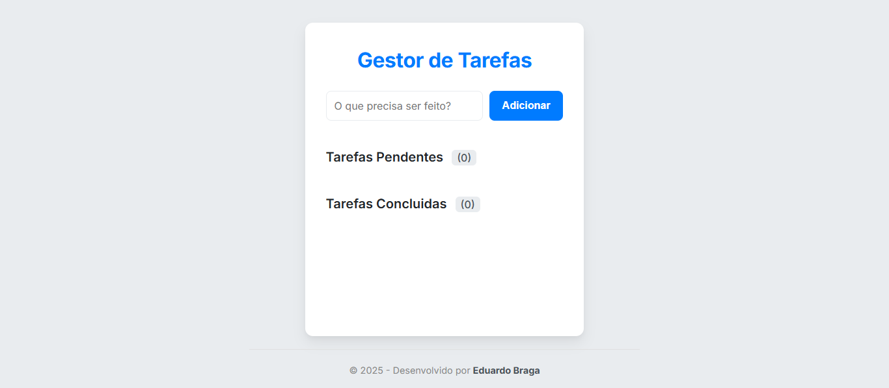

# 🚀 Gestor de Tarefas (To-Do List)

Um aplicativo web full-stack de lista de tarefas (To-Do list) construído com Flask e JavaScript puro. Este projeto permite aos usuários gerenciar suas tarefas diárias com uma interface limpa e responsiva.

Este projeto foi desenvolvido com foco em uma arquitetura profissional, separando o back-end (Flask Blueprints) do front-end (Módulos JS).



---

## ✨ Funcionalidades (Features)

* **CRUD Completo:** Crie, Leia, Atualize e Delete tarefas.
* **Edição Direta:** Edite a descrição das tarefas diretamente na lista.
* **Timestamps:** Acompanhe automaticamente quando uma tarefa foi "Criada" e "Concluída".
* **Contadores Dinâmicos:** Veja o número de tarefas pendentes e concluídas em tempo real.
* **Banco de Dados Persistente:** As tarefas são salvas em um banco de dados SQLite.
* **Design Responsivo:** Funciona em desktops e celulares.

---

## 🛠️ Tecnologias Utilizadas

### Back-end
* **Python**
* **Flask** (com **Blueprints** para organização de rotas)
* **SQLite3** (para o banco de dados)

### Front-end
* **HTML5**
* **CSS3** (com design moderno e responsivo)
* **JavaScript (ES6+)** (com Módulos `import`/`export` para organização)
* **Fetch API** (para comunicação assíncrona com o back-end)

---

## 🏁 Como Rodar o Projeto Localmente

Siga os passos abaixo para executar o projeto em sua máquina.

1.  **Clone o repositório:**
    ```bash
    git clone [https://github.com/EduBraga7/gestor-de-tarefas.git](https://github.com/EduBraga7/gestor-de-tarefas.git)
    cd gestor-de-tarefas
    ```

2.  **Crie e ative um ambiente virtual:**
    ```bash
    # No Windows
    python -m venv venv
    .\venv\Scripts\activate
    
    # No macOS/Linux
    python3 -m venv venv
    source venv/bin/activate
    ```

3.  **Instale as dependências:**
    (O arquivo `requirements.txt` que você acabou de criar)
    ```bash
    pip install -r requirements.txt
    ```

4.  **Execute a aplicação:**
    (O `app.py` irá automaticamente criar o `database.db` na primeira execução)
    ```bash
    python app.py
    ```

5.  **Abra no navegador:**
    Acesse [http://127.0.0.1:5000](http://127.0.0.1:5000)

---

## 👨‍💻 Desenvolvido por

* **Eduardo Braga do Prado**
* [GitHub](https://github.com/EduBraga7)